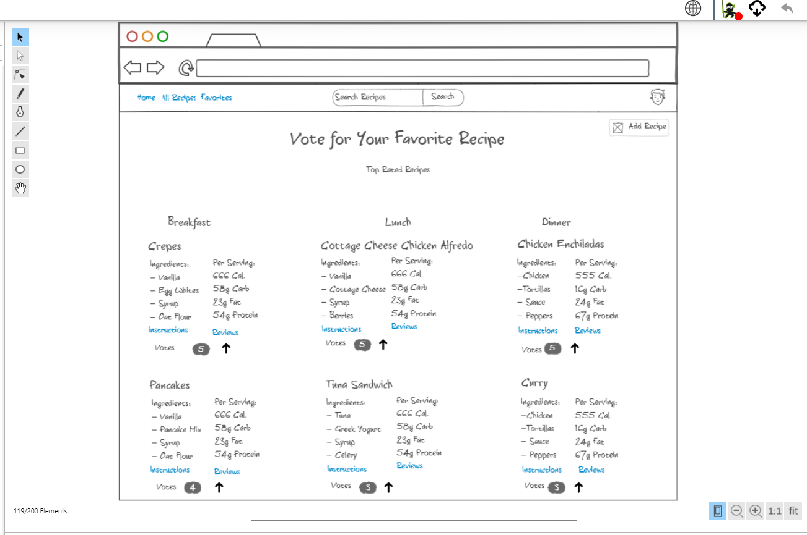
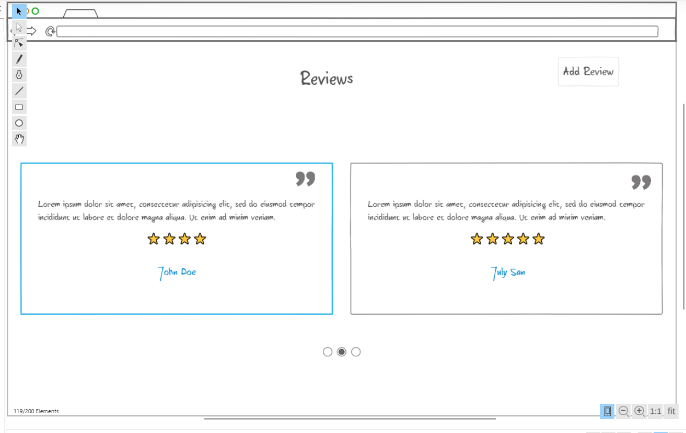
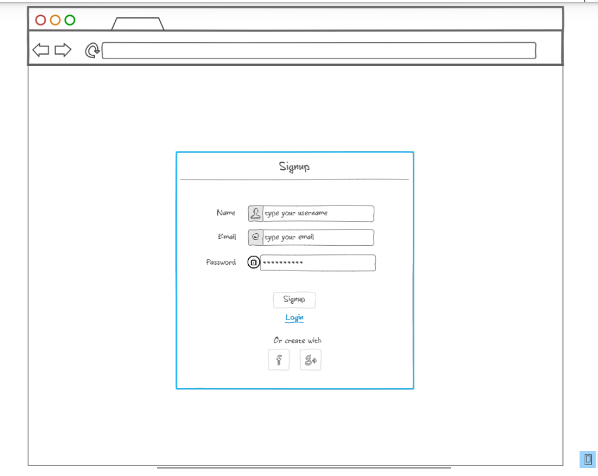
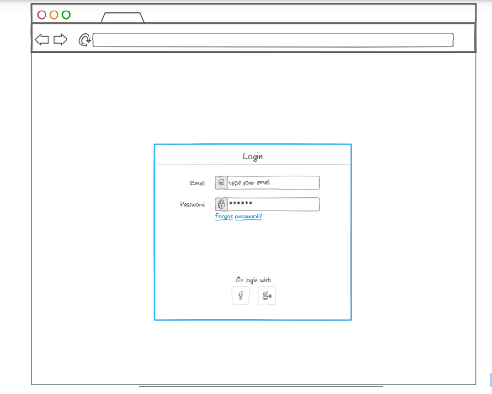

# Healthy Recipes
## Elevator Pitch
Trying to eat healthier or struggling to keep all of your favorite recipes organized? Want to try your friend's favorite recipes? Introducing "Healthy Recipes". Share and try favorite recipes with those you trust and hear what they have to say about their newly discovered recipes. No longer scrolling through recipes that don't fit your diet or are too bland to even try. Keep track of your favorite recipes to make again and again to satisfy that craving for deliciousness.

## Design

## Key Features
- Secure login over HTTPS
- Ability to upload recipes
- Ability to vote on recipes
- Ordering of recipes based on votes
- Reviews can be added and stored persistently
- Reviews are displayed for each recipe

## Technologies
- **HTML** - Four HTML pages, one for login, signup, reviews, and recipes. Hyperlinks connect recipes and reviews
- **CSS** - Used to display recipes and nutritional information in a simple clean format that is easily readable on multiple screen sizes.
- **JavaScript** - Provides login, choice display, applying votes, display number of votes, backend endpoint calls.
- **Service** - Backend service with endpoints for:
  - Login
  - submitting votes
  - submitting reviews
  - retrieving votes
  - submitting recipes
  - displaying recipes
- **DB/Login** - Store users, votes, and reviews in the database. Register and login users with their credentials stored securely in database. Can't vote, upload recipes, or add reviews unless authenticated.
- **WebSocket** - User-added reviews and recipes are pulled from the webserver. Votes are displayed for all users.
- **React** - Applicated ported to use the React web framework.

## HTML Deliverable
- Three HTML pages that allow for login/sign on, recipes, and reviews
- Every page has links to the other pages
- **WebSocket** - The count of votes represents the tally of realtime votes.
- Three images for Breakfast/Lunch/Dinner
- Text to display recipes/ingredients and reviews
- Recipes and reviews stored in the database and loaded

## CSS Deliverable
- **Header, footer and main content body**
- **Navigation elements** - I dropped the underlines and made them horizontal. Also changed the color
- **Responsive to window resizing** - It dynamically adjusts based on the window size
- **Application elements** - Everything is visible and follows a theme
- **Application text content** - consistent fonts and varying sizes to emphasize importance
- **Application images** - Added border to the images and made them similar in size

## JavaScript Deliverable

## Service Deliverable

## DB/Login Deliverable

## WebSocket Deliverable

## React Deliverable

## Reference notes at [Notes](https://github.com/CarterG2099/startup/blob/main/notes.md)
